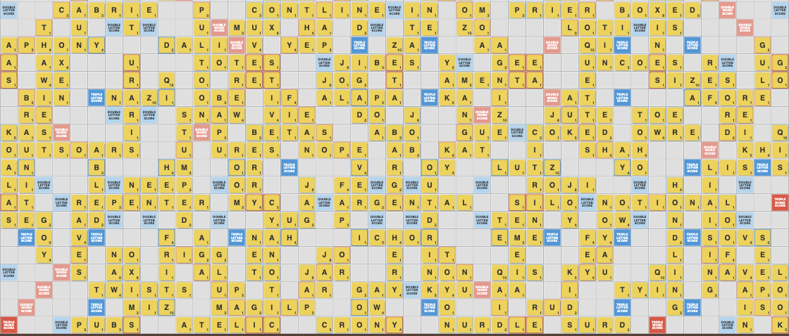
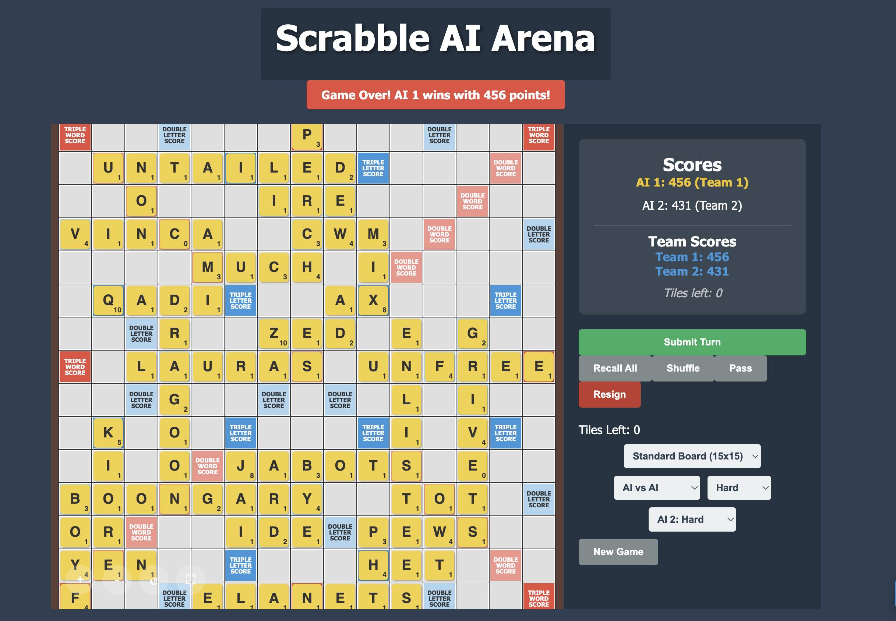

# 🎲 Scrabble AI Arena

> **An advanced Scrabble implementation with optimized AI opponents, experimental game variants, and team-based mega board battles**




<div align="center">


[Play Now](#-getting-started) • [Features](#-features) • [Variants](#-board-variants) • [Tech Stack](#-tech-stack)

</div>

---

## 🌟 What Makes This Special?

This isn't just another Scrabble clone. **Scrabble AI Arena** is a high-performance testing ground for AI strategies with:

- **🎯 Optimized AI** - DAWG/Trie-based move generation with cross-set pruning
- **🏟️ Mega Board** - 45x45 grid with 8-player team battles
- **🧪 Experimental Variants** - Modified rulesets to challenge AI decision-making
- **🤖 Multi-Difficulty AI** - Compare strategies across Easy/Medium/Hard opponents
- **📊 AI vs AI Mode** - Watch different difficulties compete for strategy analysis
- **⚡ Real-Time Validation** - SOWPODS dictionary with 267,751 words
- **🎨 Team Color Coding** - Visual distinction for team members

## ✨ Features

### 🎮 Core Gameplay
- **Complete Scrabble Implementation** - Official rules with full tile bag
- **Drag & Drop Interface** - Smooth tile placement with `@dnd-kit`
- **Instant Validation** - Live preview shows validity and score in real-time
- **Smart Word Detection** - Validates all formed words including cross-words
- **Move History** - Track every play throughout the game
- **Full-Screen Mode** - Optimized for mega board viewing

### 🤖 AI Opponents

**Optimized with Professional Techniques:**
- **DAWG/Trie Data Structure** - O(1) word validation and prefix checking
- **Rack-Based Word Generation** - Only generates playable words from current tiles
- **Board-Aware Search** - Finds words that extend existing board tiles
- **Cross-Set Pruning** - Pre-calculates valid letters at each position
- **Alpha-Beta Pruning** - Skips unpromising branches in HARD mode

**Three Difficulty Levels:**

| Difficulty | Strategy | Performance |
|-----------|----------|-------------|
| **Easy** 🟢 | Random from all valid moves | ~50-200ms |
| **Medium** 🟡 | Random from top 50% moves | ~100-500ms |
| **Hard** 🔴 | Always highest-scoring move | ~200-1000ms |

**AI Features:**
- Uses full SOWPODS dictionary (267,751 words)
- Validates all words (including cross-words) before playing
- Team-aware resignation (only resigns if all teammates stuck)
- Generates moves in <1 second even on Mega Board
- Fully optimizes for bonus squares (DW/TW/DL/TL)

### 🏟️ Board Variants

#### 🟦 Standard (15x15)
Classic Scrabble layout - the baseline for comparison

#### ⚡ Bonus Blitz (15x15)
**2.5x more bonus squares** for aggressive scoring strategies
- Tests AI's ability to maximize multipliers
- Favors positional play over vocabulary

#### 🎲 Random (15x15)
**Procedurally generated bonus placement** every game
- Eliminates memorized optimal positions
- Tests AI adaptability to unknown layouts

#### ⚠️ Hazards (15x15)
**Risk/reward gameplay** with dangerous squares
- Hazard squares **deduct 10 points**
- Forces strategic risk assessment

#### 🏟️ Mega Board (45x45)
**The Ultimate Scrabble Challenge**

A massive 45x45 grid designed for 8-player team battles (4v4). Features:
- **Extended Premium Squares** - Strategic DL/TL/DW/TW placement across the expanded board
- **Team Mode** - Red vs Blue teams with color-coded tiles for easy tracking
- **Longer Games** - More space = more complex strategies and higher scores
- **Performance Optimized** - Handles 2,025 squares smoothly



### 🎯 Game Modes

- **👤 Human vs AI** - Classic gameplay with AI opponent
- **🤖 AI vs AI** - Watch and learn from AI strategies
  - Set different difficulties for each AI
  - Great for benchmarking and analysis
- **👥 Teams (Mega Only)** - 4v4 team battles on the mega board
  - Red Team vs Blue Team
  - Color-coded tiles by team
  - Team-aware AI resignation logic
  - Interleaved turn order

## 🚀 Getting Started

### Prerequisites
```bash
node --version  # v18.0.0 or higher
npm --version   # v9.0.0 or higher
```

### Quick Start

```bash
# Clone
git clone https://github.com/xerk-dot/scrabble_with_gemini_3.0.git
cd scrabble_with_gemini_3.0

# Install
npm install

# Run
npm run dev
```

**Open** → [http://localhost:3000](http://localhost:3000) 🎉

### Production Build

```bash
npm run build
npm start
```

## 🎮 How to Play

### 1️⃣ **Setup**
- Choose **board variant** (Standard, Bonus Blitz, Random, Hazards, or Mega)
- Select **game mode** (Human vs AI, AI vs AI, or Teams for Mega)
- Pick **AI difficulty** (or two for AI vs AI)
- Click **"New Game"**

### 2️⃣ **Make Moves**
- **Drag tiles** from rack to board
- **Live preview** shows validity ✓/✗ and score
- **Submit** to play or **Recall** to undo

### 3️⃣ **Actions**
| Button | Action |
|--------|--------|
| Submit | Play your word |
| Recall | Take back tiles |
| Shuffle | Reorganize rack |
| Pass | Skip turn |
| Resign | Give up (when stuck) |

### 4️⃣ **Win**
- **Highest score** when all players resign
- **Team mode**: Highest team score wins
- AI auto-resigns when no valid moves exist (team-aware)

## 🏗️ Tech Stack

- **Framework** → [Next.js 15](https://nextjs.org/) with App Router
- **Language** → TypeScript for type safety
- **UI** → React 18 with CSS Modules
- **Drag & Drop** → [@dnd-kit/core](https://dndkit.com/)
- **Validation** → Server Actions with SOWPODS
- **State** → React Context API
- **AI Optimization** → DAWG/Trie, Cross-Sets, Alpha-Beta Pruning

## 📊 AI Architecture

### Optimization Techniques

1. **DAWG/Trie Data Structure** (`src/lib/dawg.ts`)
   - O(1) word validation
   - Instant prefix checking
   - Cached globally for performance

2. **Rack-Based Word Generation** (`src/lib/word-generator.ts`)
   - Generates only words from available tiles
   - Handles blank tiles (tries all 26 letters)
   - Board-aware extensions (e.g., CAT → CATS)

3. **Cross-Set Pruning** (`src/lib/cross-sets.ts`)
   - Pre-calculates valid letters at each position
   - Filters invalid placements before validation
   - Separate sets for horizontal/vertical plays

4. **Alpha-Beta Pruning** (HARD mode only)
   - Skips words that can't beat current best score
   - Estimates maximum possible score
   - 2-3x speedup for HARD difficulty

### Performance Characteristics

**Expected Performance:**
- Standard board: <100ms per move
- Mega Board: <1 second per move (HARD mode)
- 100% accuracy maintained

**Speedup vs Brute Force:**
- 10-100x faster on average
- Scales well to Mega Board (45x45)

## 📁 Project Structure

```
src/
├── app/
│   ├── actions.ts          # 🔍 Word validation (Server Actions)
│   ├── ai-actions.ts       # 🤖 Optimized AI move generation
│   └── page.tsx            # 📄 Main page
├── components/
│   ├── Board.tsx           # 🎲 Game board with team colors
│   ├── Game.tsx            # 🎮 Game controller
│   ├── Rack.tsx            # 🎫 Tile rack with controls
│   ├── Square.tsx          # ⬜ Board squares
│   └── Tile.tsx            # 🔠 Individual tiles (team colored)
├── context/
│   └── GameContext.tsx     # 🔄 State management & team logic
└── lib/
    ├── constants.ts        # 📋 Board layouts (including Mega)
    ├── cross-sets.ts       # 🎯 Cross-set calculation
    ├── dawg.ts             # 🌳 DAWG/Trie data structure
    ├── gameUtils.ts        # 🛠️ Board init, tile bag
    ├── scoring.ts          # 📊 Score calculation
    ├── teamColors.ts       # 🎨 Team color utilities
    ├── types.ts            # 📝 TypeScript types
    ├── validation.ts       # ✅ Move validation
    └── word-generator.ts   # 📝 Rack-based word generation
```

## 🤝 Contributing

Built with [Google Gemini](https://deepmind.google/technologies/gemini/) assistance.

Contributions welcome! Feel free to:
- 🐛 Report bugs
- 💡 Suggest new variants
- 🚀 Submit PRs
- 📖 Improve docs

## 📝 License

MIT License - see [LICENSE](LICENSE)

## 🙏 Acknowledgments

- **Inspiration** - Classic Scrabble by Hasbro
- **AI Assistant** - Google Gemini 3.0

---

<div align="center">

**Optimized AI • Mega Battles • Team Play** 🎲✨

[Report Bug](https://github.com/xerk-dot/scrabble_with_gemini_3.0/issues) • 
[Request Feature](https://github.com/xerk-dot/scrabble_with_gemini_3.0/issues)

</div>
